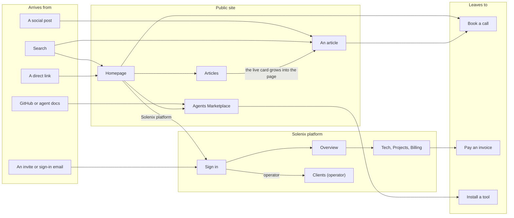
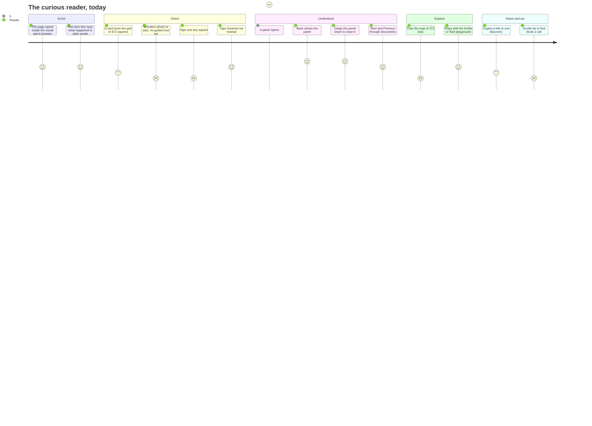
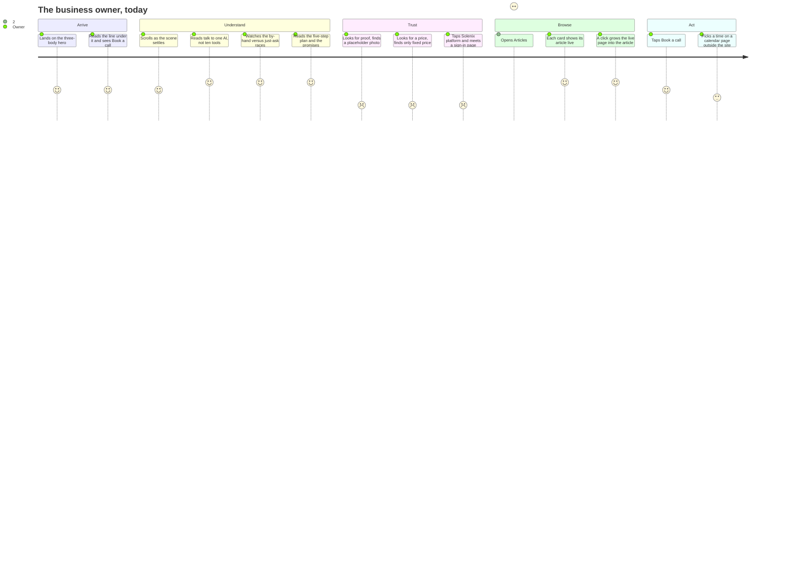
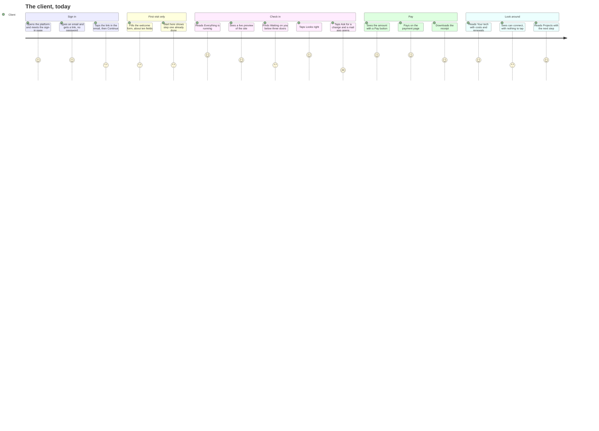
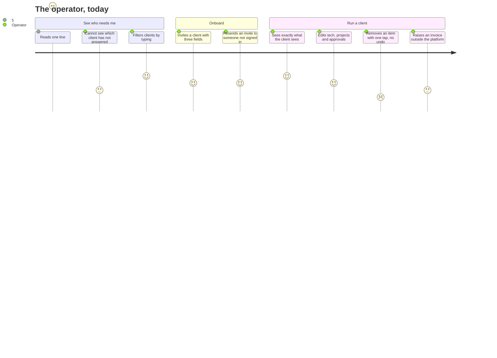
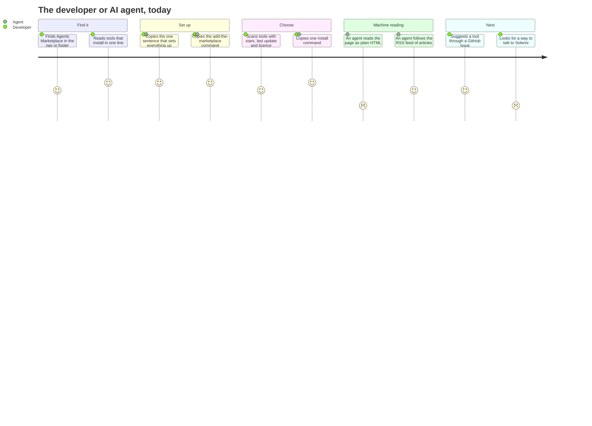
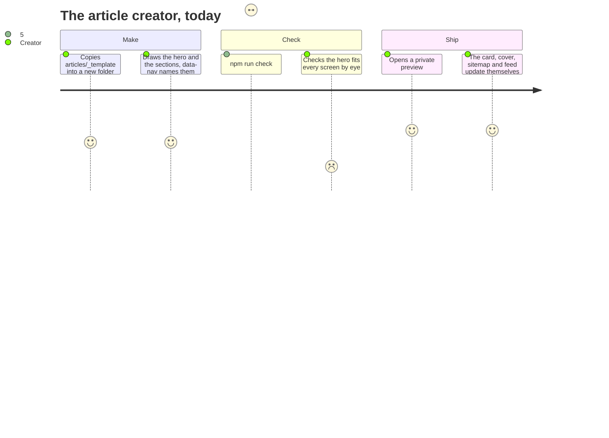
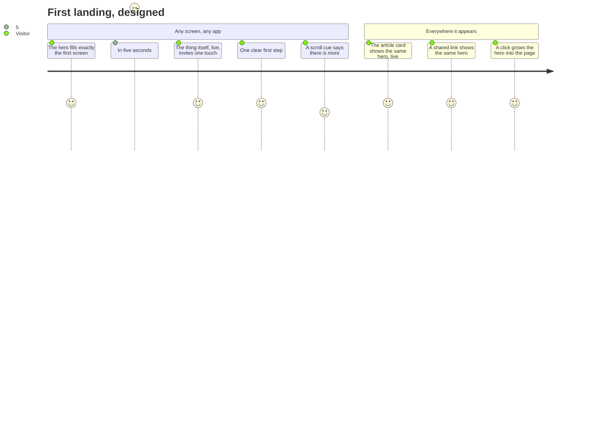

# User journeys

Every page on solenix.dev exists for a person who wants something. Each journey below is that person's story, then every step, scored for how it feels **today**: 1 is bad, 5 is great. A step at 3 or less is the next thing to fix. A step with no value is removed.

`npm run check` fails if a page on the site belongs to no journey (`scripts/journey-check.ts`). Add or change a page: add or change its journey here first.

## The whole map

## 1. The curious reader

**As** someone who knows no math and taps a link in a social app on my phone, **I want** to understand what happened and play with one result, **so that** I feel I got it and I remember who made the page.

Pages: /articles/proof-flood

What would raise the low steps:
- **Where to start (2):** a short guided tour for someone who knows no math.
- **Tiny square (2):** on a phone each square is about 11 px. Fewer columns on small screens, or tapping the touring card opens its discovery.
- **Tour order (3):** the hero tour and the Start here strip pick "famous" differently. Use one list.
- **Map (2):** 372 dots shrink to a third of their size on a phone. Open on Cards on small screens.
- **Share (3):** a link to one discovery previews the whole article. A page and image per discovery, and the phone's share sheet.
- **Book a call (2):** a quiet line in each discovery panel.

## 2. The business owner

**As** a small-business owner looking at Solenix, **I want** to see what would change in my week and what it costs, **so that** I can decide in a few minutes whether to book a call.

Pages: /, /articles, /book

What would raise the low steps:
- **Proof (2):** a real photo and one real client result.
- **Price (2):** a starting price or a typical range.
- **Solenix platform (2):** the sign-in page's "New here?" should lead to Book a call, not an email.
- **Articles heading (2):** the first screen should be a designed hero, not a block of text.
- **Calendar (3):** the booking page leaves the Solenix look.

## 3. The client

**As** a client, **I want** to see that my site is fine, answer what waits for me and pay an invoice, **so that** I never chase anyone or open seven vendor logins.

Pages: /app/login, /app/auth/confirm, /app/auth/finish, /app/welcome, /app, /app/tech, /app/projects, /app/billing, /app/billing/[invoice]

What would raise the low steps:
- **Continue (3):** the extra tap stops mail scanners from using the link. Keep it, and say why in one line.
- **Welcome form (3):** fill in what is already known; ask only what is missing.
- **Step one done (3):** remove a step that is always done.
- **Waiting on you (3):** show it first when something waits.
- **Ask for a change (2):** a box on the page that saves the request.
- **Can connect (3):** one tap asks for it.

## 4. The operator

**As** the person who runs Solenix, **I want** to invite clients, see who needs me and update their work, **so that** the platform runs the business and nothing lives in a spreadsheet.

Pages: /app/admin/clients, /app/admin/clients/[id], /app/admin/clients/[id]/manage, /app/admin/clients/[id]/tech, /app/admin/clients/[id]/projects, /app/admin/clients/[id]/billing, /app/admin/clients/[id]/billing/[invoice]

What would raise the low steps:
- **Not answered (3):** a "Waiting on client" badge in the list.
- **One-tap remove (2):** an undo, or a confirm.
- **Invoices (3):** raise them from the platform, or link straight to them.

## 5. The developer or AI agent

**As** a developer or an AI agent, **I want** to add the Solenix marketplace and install a tool in one line, **so that** my agent can use it today.

Pages: /agents, /articles/rss.xml

What would raise the low steps:
- **Machine reading (2):** an `/llms.txt` that points to the setup guide and the marketplace file.
- **Talk to Solenix (2):** one line with Book a call.

## 6. The article creator

**As** a person or an agent making an article, **I want** to add one folder and have everything else happen, **so that** a new article is right the first time.

Pages: /articles, /articles/proof-flood

What would raise the low steps:
- **Hero fit (2):** an automatic check that renders the hero at every screen size real visitors use, plus the smallest and largest, and fails on any overflow or clipping.

## First landing on any page: the hero

Every page's first screen is its hero. A hero that does not fit the screen has failed as a hero.

Pages: /, /articles, /articles/proof-flood

