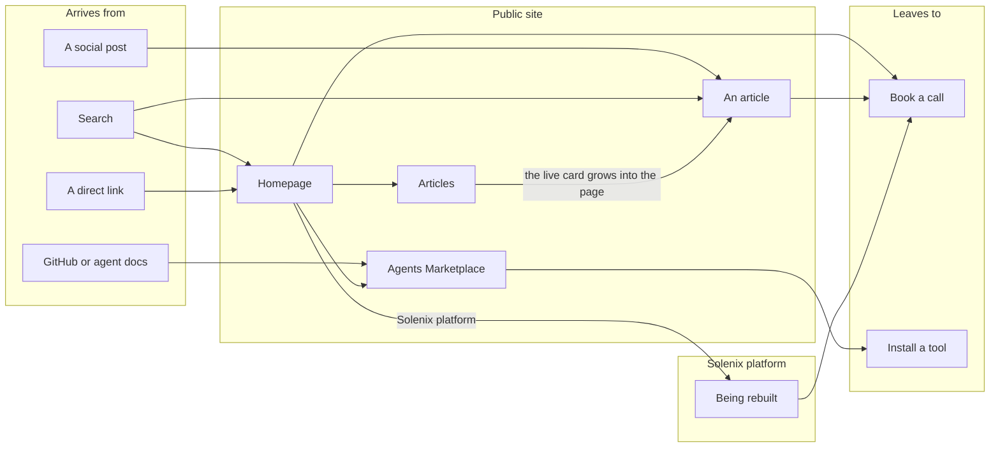
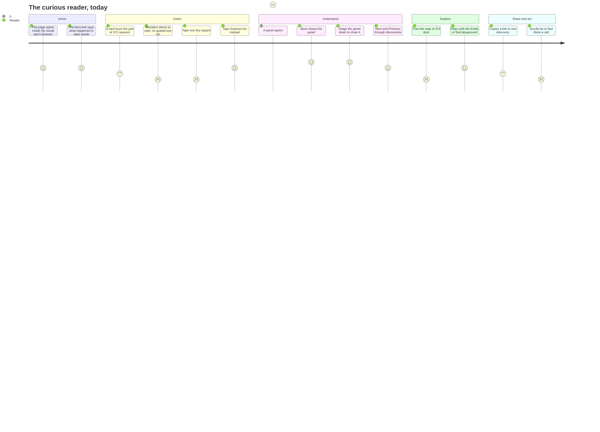
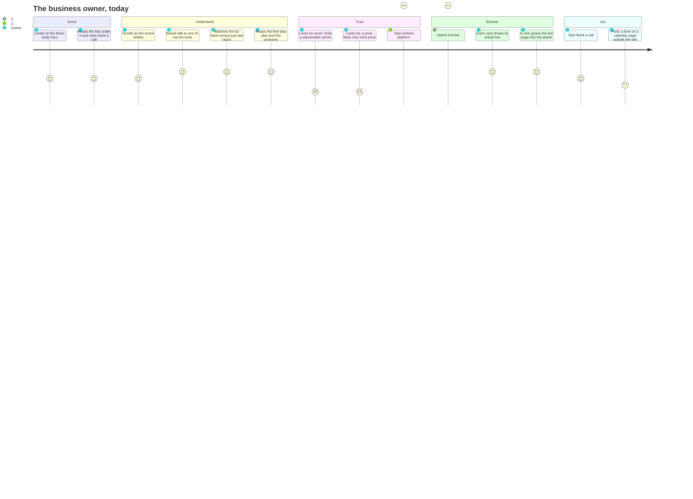
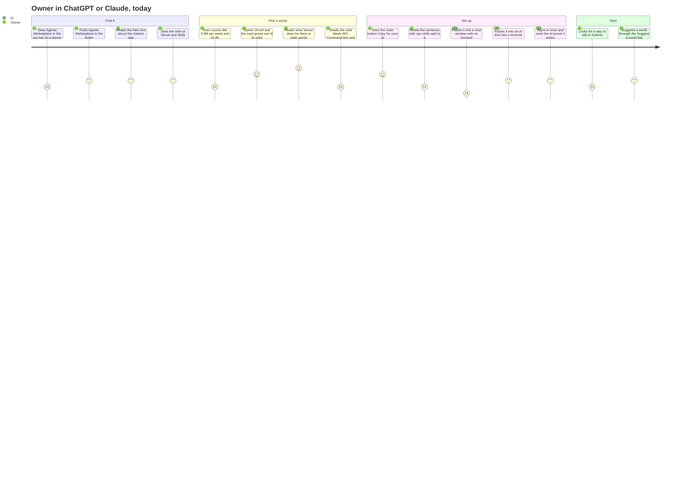
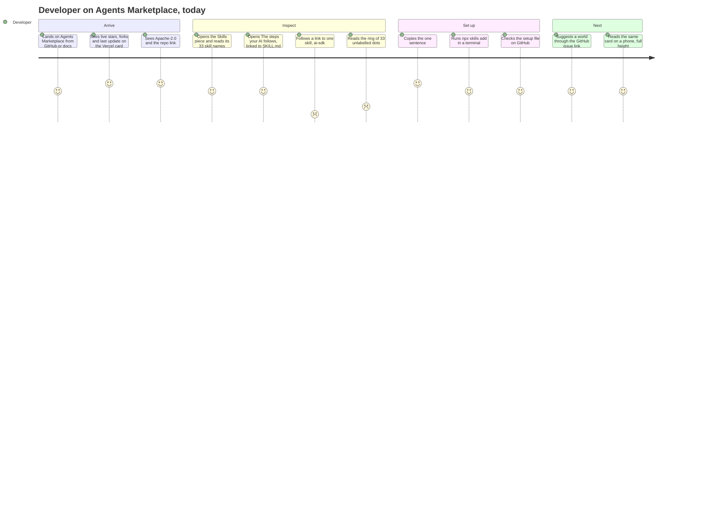
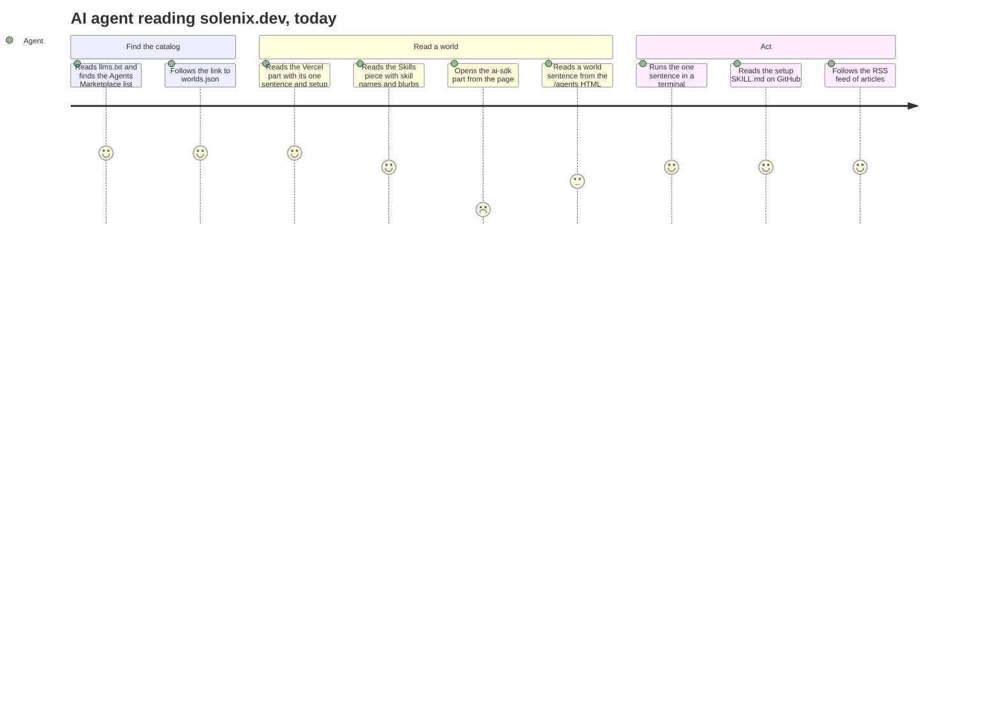
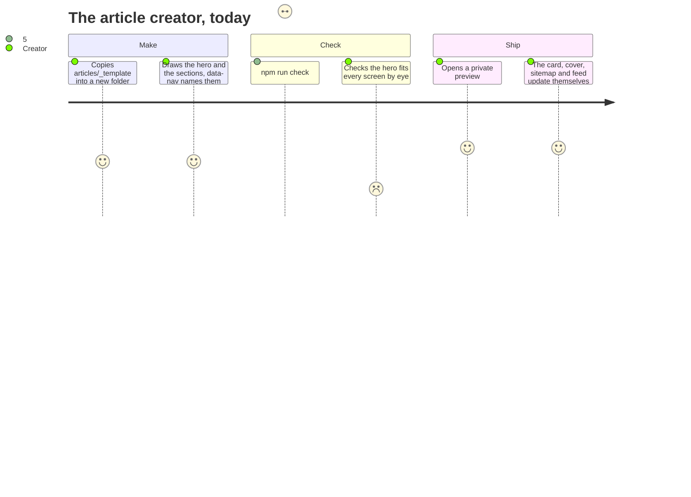
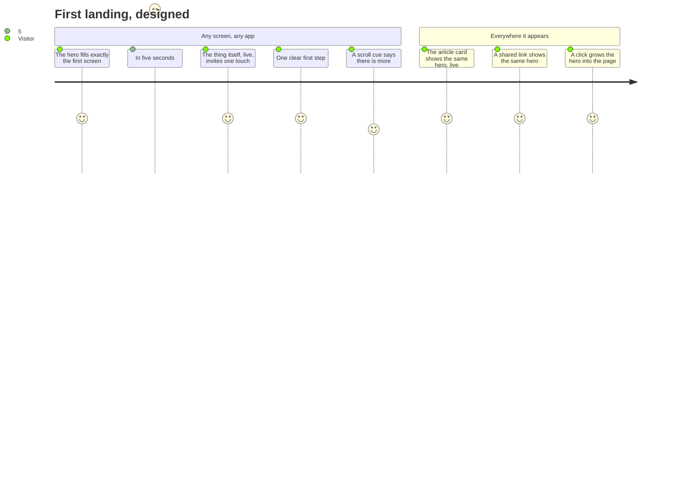

# User journeys

Every page on solenix.dev exists for a person who wants something. Each journey below is that person's story, then every step, scored for how it feels **today**: 1 is bad, 5 is great. A step at 3 or less is the next thing to fix. A step with no value is removed.

`npm run check` fails if a page on the site belongs to no journey (`scripts/journey-check.ts`). Add or change a page: add or change its journey here first.

## The whole map

## 1. The curious reader

**As** someone who knows no math and taps a link in a social app on my phone, **I want** to understand what happened and play with one result, **so that** I feel I got it and I remember who made the page.

Pages: /articles/proof-flood

What would raise the low steps:
- **Where to start (2):** a short guided tour for someone who knows no math.
- **Tiny square (2):** on a phone each square is about 11 px. Fewer columns on small screens, or tapping the touring card opens its discovery.
- **Tour order (3):** the hero tour and the Start here strip pick "famous" differently. Use one list.
- **Map (2):** 372 dots shrink to a third of their size on a phone. Open on Cards on small screens.
- **Share (3):** a link to one discovery previews the whole article. A page and image per discovery, and the phone's share sheet.
- **Book a call (2):** a quiet line in each discovery panel.

## 2. The business owner

**As** a small-business owner looking at Solenix, **I want** to see what would change in my week and what it costs, **so that** I can decide in a few minutes whether to book a call.

Pages: /, /articles, /app, /book

What would raise the low steps:
- **Proof (2):** a real photo and one real client result.
- **Price (2):** a starting price or a typical range.
- **Solenix platform (3):** being rebuilt; it opens again with the new platform.
- **Articles heading (2):** the first screen should be a designed hero, not a block of text.
- **Calendar (3):** the booking page leaves the Solenix look.

## 3. The client

The old portal was removed on 2026-10-09. This journey returns with the new Solenix platform.

## 4. The operator

The old portal was removed on 2026-10-09. This journey returns with the new Solenix platform.

## 5. Anyone setting up their AI (and the AI itself)

**As** someone who uses AI, developer or not, **I want** to set up a tool the way its makers intended with one copy-paste, **so that** my AI can do real work with it today, without me learning what a skill, connector or CLI is.

Pages: /agents, /articles/rss.xml

Three people use this surface. Each one has a diagram, scored for how it feels **today**, from screenshots at 1440 and 390 wide taken 2026-10-09. Plus the agent-facing files: /llms.txt and /agents/worlds.json.

### 5a. The small-business owner, in ChatGPT or Claude

Lowest steps to raise:
- **Pasting into a chat with no terminal (1):** the sentence in the Vercel world card runs `npx skills add`. ChatGPT and Claude chat cannot run it. Under the sentence, add one plain line: "Chat only? Book a call and we set it up." The line links to Book a call.
- **Top bar on a phone (2):** the header at 390 px shows Articles and Platform only. Keep Agents Marketplace in the top bar at phone width.
- **Orbit labels (2):** the Vercel orbit in the world card shows API, Command line and Connector with version numbers. Add one plain line under each label, for example: "Command line: runs commands on your computer."
- **Counts (2):** the world cards show 3.9M per week and 16.4K stars. Add a plain word beside each number, or move the numbers into the card details.
- **Talk to Solenix (2):** the /agents page has no Book a call. Add it in the page header, beside the Solenix platform link.

### 5b. The developer

Lowest steps to raise:
- **The ai-sdk link (1):** the URL `?world=vercel&piece=skills&part=ai-sdk` opens the Skills list. The ai-sdk part does not open. Make each part link open its own item, with its name and blurb.
- **The ring of 33 dots (2):** in the Skills view, the dots have no labels. Label each dot with its skill name, or remove the ring and keep the chips.

### 5c. The AI agent, reading the page or the files

Lowest steps to raise:
- **The ai-sdk link (1):** an agent cannot address one skill. Give each part its own URL, and list that URL on its entry in worlds.json.
- **The sentence in HTML (3):** the Vercel sentence appears only after `?world=vercel` opens. Render the sentence in the card's first HTML, so an agent reads it without a click.

### Not yet checked

- The sign-in and "the AI proves it works" step has not been run, so its score is a guess.
- The sentence was not run in a terminal. The command matches llms.txt and worlds.json.
- The Copy for your AI click was not tested.

## 6. The article creator

**As** a person or an agent making an article, **I want** to add one folder and have everything else happen, **so that** a new article is right the first time.

Pages: /articles, /articles/proof-flood

What would raise the low steps:
- **Hero fit (2):** an automatic check that renders the hero at every screen size real visitors use, plus the smallest and largest, and fails on any overflow or clipping.

## First landing on any page: the hero

Every page's first screen is its hero. A hero that does not fit the screen has failed as a hero.

Pages: /, /articles, /articles/proof-flood

